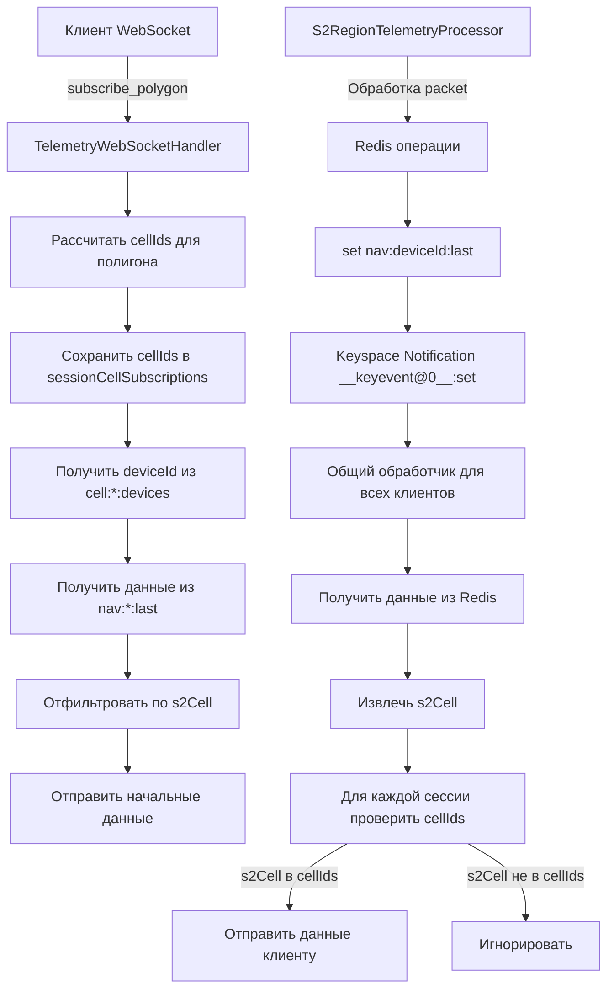

# Redis Keyspace Notifications Migration Plan (Упрощенная архитектура)

## Обзор
Миграция с Redis pub/sub на keyspace notifications с упрощенной архитектурой. Вместо отслеживания deviceId и cell updates, используем фильтрацию по s2Cell на стороне приложения.

## Текущая архитектура (сложная)
- `S2RegionTelemetryProcessor` публикует 2 типа событий:
  - `CellUpdateEvent` → `cell.updates` (перемещение между ячейками)
  - `TelemetryUpdateEvent` → `nav.updates` (обновление телеметрии)
- `TelemetryWebSocketHandler` отслеживает:
  - `sessionCellSubscriptions`: cellId для каждой сессии
  - `sessionDeviceSubscriptions`: deviceId для каждой сессии
- Двойная фильтрация: по cellId и по deviceId

## Новая архитектура (упрощенная)
- **Удалены все события pub/sub**
- **Одна подписка**: `__keyevent@0__:set` для всех `nav:*:last` обновлений
- **Фильтрация по s2Cell**: На стороне приложения, на основе актуальных данных
- **Расшаривание потока**: Все клиенты используют один поток уведомлений

## Преимущества новой архитектуры
1. **Проще код**: На 50+ строк меньше, меньше состояний
2. **Автоматические уведомления**: Redis keyspace notifications вместо ручной публикации
3. **Точная фильтрация**: По актуальному s2Cell из данных телеметрии
4. **Эффективнее**: Один поток уведомлений для всех клиентов
5. **Надежнее**: Нет рассинхронизации между cell updates и telemetry updates

## Архитектурная диаграмма



## Изменения в коде

### 1. TelemetryWebSocketHandler.kt
```kotlin
// УДАЛЕНО:
// - sessionDeviceSubscriptions
// - handleCellUpdate() метод
// - Обработка CellUpdateEvent
// - Подписка на cell.updates канал

// ДОБАВЛЕНО:
// - Подписка на __keyevent@0__:set pattern
// - Метод handleTelemetryUpdate(deviceId: Long)
// - Фильтрация по s2Cell из данных TelemetryPacket
```

### 2. S2RegionTelemetryProcessor.kt
```kotlin
// УДАЛЕНО:
// - publishCellUpdate() метод
// - publishTelemetryUpdate() метод  
// - CHANNEL_CELL_UPDATES и CHANNEL_TELEMETRY_UPDATES константы
// - Все вызовы convertAndSend()

// СОХРАНЕНО:
// - Работа с cell:*:devices sets (для начальной загрузки)
// - Работа с nav:*:last keys (триггерит keyspace notifications)
```

## Ключевые файлы Redis

### 1. cell:{cellId}:devices (Redis Set)
- **Назначение**: Быстрая начальная загрузка при подписке
- **Операции**: `sadd` (добавление), `srem` (удаление)
- **Обновляется**: `S2RegionTelemetryProcessor.processPacket()`

### 2. nav:{deviceId}:last (Redis String)
- **Назначение**: Хранение последней телеметрии, триггер real-time обновлений
- **Операции**: `set` с TTL (1 день)
- **Триггерит**: `__keyevent@0__:set` уведомления

## Конфигурация Redis/Valkey
```yaml
# docker-compose.yml
valkey:
  image: valkey/valkey:latest
  command: valkey-server --notify-keyspace-events KEgx
```

**Флаги**:
- `K` - Keyspace events
- `E` - Keyevent events (нужен для __keyevent@0__:*)
- `g` - Generic commands (включая set)
- `x` - Expired events

## Последовательность миграции

### Фаза 1: Подготовка
1. Обновить Redis конфигурацию (уже есть `KEgx`)
2. Создать backup текущего кода

### Фаза 2: Реализация
1. Модифицировать `TelemetryWebSocketHandler`
2. Удалить публикацию событий из `S2RegionTelemetryProcessor`
3. Реализовать фильтрацию по s2Cell

### Фаза 3: Тестирование
1. Unit тесты для новой логики
2. Интеграционные тесты
3. Ручное тестирование с WebSocket клиентом

### Фаза 4: Развертывание
1. Развернуть в staging
2. Мониторинг производительности
3. Развернуть в production

## Тестовые сценарии

### 1. Начальная подписка
```
Клиент: {"type": "subscribe_polygon", "points": [...]}
Сервер: {"type": "subscription_ack", "cellCount": X, "deviceCount": Y}
+ отправка начальных данных для устройств в полигоне
```

### 2. Real-time обновления
```
1. Kafka → TelemetryPacket
2. S2RegionTelemetryProcessor → Redis set nav:deviceId:last
3. Redis → __keyevent@0__:set notification
4. TelemetryWebSocketHandler → фильтрация по s2Cell
5. WebSocket клиент получает обновление (если в полигоне)
```

### 3. Перемещение между ячейками
- Устройство меняет s2Cell
- `cell:oldCellId:devices` ← srem
- `cell:newCellId:devices` ← sadd
- `nav:deviceId:last` ← set (новые данные)
- Клиенты получают обновление если новая ячейка в их полигоне

## Мониторинг и метрики

### Метрики для отслеживания:
1. **Количество keyspace notifications** в секунду
2. **Время обработки** `handleTelemetryUpdate`
3. **Количество WebSocket соединений**
4. **Количество отправленных сообщений** на соединение

### Логи для отладки:
```kotlin
logger.debug("Received Redis message on channel $channel: $message")
logger.info("Polygon covering ${cellIds.size} cells for session ${session.id}")
logger.warn("No telemetry data found for device $deviceId")
```

## Откат на предыдущую версию

### Если возникнут проблемы:
1. **Вернуть pub/sub код**:
   - Восстановить `publishCellUpdate()` и `publishTelemetryUpdate()`
   - Восстановить подписки на каналы в `TelemetryWebSocketHandler`
2. **Отключить keyspace notifications** в Redis (убрать `KEgx`)
3. **Вернуться к отслеживанию deviceId**

### Преимущества отката:
- Проверенная архитектура
- Изолированные потоки событий
- Меньше нагрузки на Redis (нет pattern subscriptions)

## Заключение

Новая архитектура значительно упрощает код и делает систему более надежной за счет:
- Автоматических уведомлений от Redis
- Фильтрации по актуальным данным (s2Cell из телеметрии)
- Удаления сложной логики отслеживания состояний
- Расшаривания потока уведомлений между всеми клиентами

**Ожидаемое сокращение кода**: ~60 строк
**Ожидаемое улучшение надежности**: Меньше состояний для отслеживания
**Ожидаемое влияние на производительность**: Нейтральное или положительное