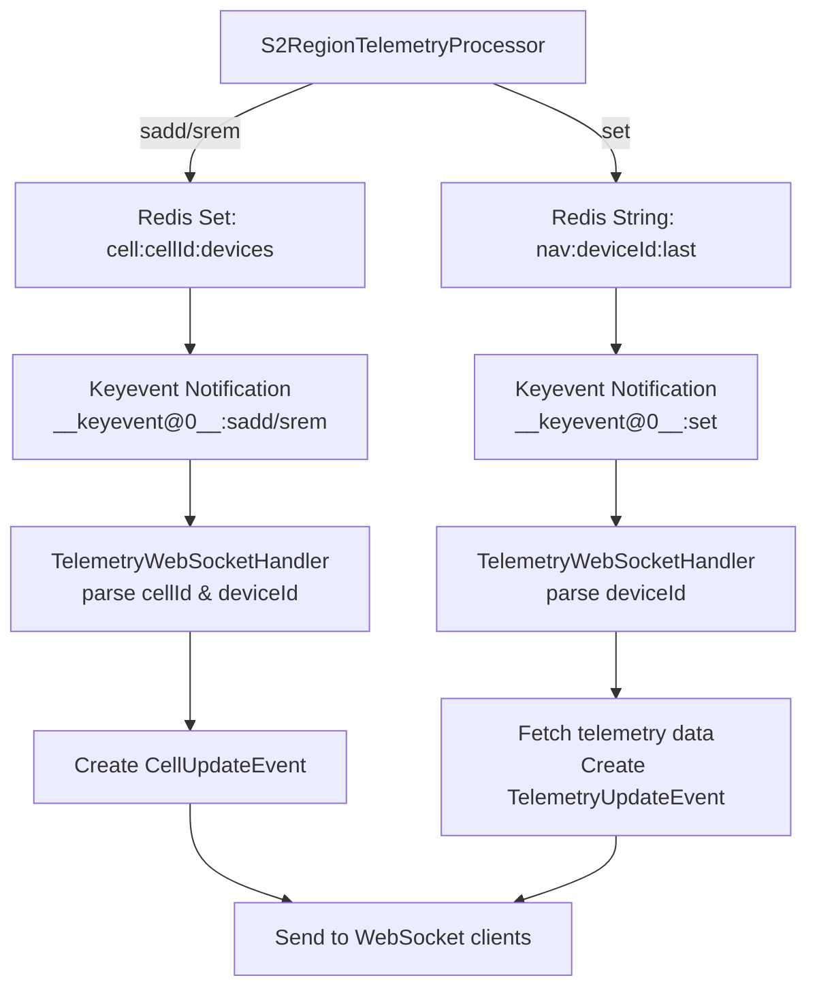

# Redis Keyspace Notifications Migration Plan

## Overview
This document outlines the plan to migrate from Redis pub/sub to keyspace notifications for real-time updates in the telemetry processor system.

## Current Architecture
- `S2RegionTelemetryProcessor` publishes events to Redis pub/sub channels:
  - `cell.updates` - CellUpdateEvent (device movement between S2 cells)
  - `nav.updates` - TelemetryUpdateEvent (telemetry data updates)
- `TelemetryWebSocketHandler` subscribes to these channels and forwards events to WebSocket clients

## Target Architecture
- Remove explicit event publishing
- Use Redis keyspace notifications triggered automatically by Redis operations
- `TelemetryWebSocketHandler` subscribes to keyspace notification patterns
- Events are automatically triggered by `sadd`, `srem`, and `set` operations

## Benefits
1. **Simpler code** - No explicit event publishing logic
2. **More reliable** - Notifications are automatic if Redis operation succeeds
3. **Better performance** - No serialization/deserialization overhead for events
4. **Reduced latency** - Direct notification from Redis operations

## Technical Design

### Redis Configuration
Redis/Valkey must have keyspace notifications enabled:
```yaml
# docker-compose.yml
valkey:
  image: valkey/valkey:latest
  command: valkey-server --notify-keyspace-events KEgx
```

Flags explanation:
- `K` - Keyspace events (channel: `__keyspace@0__:keyname`)
- `E` - Keyevent events (channel: `__keyevent@0__:eventname`)
- `g` - Generic commands (DEL, EXPIRE, etc.)
- `x` - Expired events

### Key Patterns

#### Cell Updates
- **Key pattern**: `cell:{cellId}:devices` (Redis Set)
- **Operations**: `sadd` (ADD), `srem` (REMOVE)
- **Notification pattern**: `__keyevent@0__:sadd` and `__keyevent@0__:srem`
- **Data extraction**: Parse key to get cellId, parse message to get deviceId

#### Telemetry Updates
- **Key pattern**: `nav:{deviceId}:last` (Redis String)
- **Operations**: `set` (UPDATE)
- **Notification pattern**: `__keyevent@0__:set`
- **Data extraction**: Parse key to get deviceId, fetch value from Redis

### Message Flow


## Implementation Steps

### 1. Update TelemetryWebSocketHandler
- Change subscription from pub/sub channels to keyevent patterns
- Update `handleRedisMessage` to parse keyevent notifications
- Implement logic to extract cellId/deviceId from key names
- For telemetry updates, fetch data from Redis

### 2. Modify S2RegionTelemetryProcessor
- Remove `publishCellUpdate()` method
- Remove `publishTelemetryUpdate()` method  
- Remove channel constants (`CHANNEL_CELL_UPDATES`, `CHANNEL_TELEMETRY_UPDATES`)
- Remove calls to publishing methods in `processPacket()`

### 3. Update RedisConfig (if needed)
- Ensure RedisTemplate is properly configured for pattern subscriptions
- No changes needed if using default Spring Data Redis configuration

## Code Changes

### TelemetryWebSocketHandler.kt
```kotlin
// Current
redisMessageListenerContainer.addMessageListener(
    redisMessageListener, 
    ChannelTopic(S2RegionTelemetryProcessor.CHANNEL_CELL_UPDATES)
)

// New
redisMessageListenerContainer.addMessageListener(
    redisMessageListener,
    PatternTopic("__keyevent@0__:sadd")
)
redisMessageListenerContainer.addMessageListener(
    redisMessageListener,
    PatternTopic("__keyevent@0__:srem")
)
redisMessageListenerContainer.addMessageListener(
    redisMessageListener,
    PatternTopic("__keyevent@0__:set")
)
```

### S2RegionTelemetryProcessor.kt
```kotlin
// Remove these methods:
private fun publishCellUpdate(cellId: Long, deviceId: Long, action: String)
private fun publishTelemetryUpdate(packet: TelemetryPacket)

// Remove these calls in processPacket():
// publishCellUpdate(oldS2, telemetryPacket.deviceId, "REMOVE")
// publishCellUpdate(newS2, telemetryPacket.deviceId, "ADD")  
// publishTelemetryUpdate(telemetryPacket)
```

## Testing Strategy

### Unit Tests
1. Test key parsing logic
2. Test event creation from notifications
3. Test WebSocket message forwarding

### Integration Tests
1. Verify Redis operations trigger notifications
2. Verify WebSocket clients receive updates
3. Test polygon subscription functionality

### Manual Testing
1. Start Redis with keyspace notifications
2. Run application
3. Connect WebSocket client
4. Subscribe to polygon
5. Send telemetry packet
6. Verify WebSocket receives updates

## Potential Issues and Solutions

### Issue 1: Missing deviceId in cell notifications
- **Problem**: Keyspace notifications don't include which member was added/removed
- **Solution**: Use `__keyevent@0__:sadd`/`srem` which includes the member in the message

### Issue 2: Race conditions
- **Problem**: ADD and REMOVE operations may happen in quick succession
- **Solution**: Ensure atomic operations in S2RegionTelemetryProcessor

### Issue 3: Performance with many keys
- **Problem**: Pattern subscriptions may impact performance
- **Solution**: Use specific patterns, not wildcard `*`

## Rollback Plan
If issues arise, revert to pub/sub by:
1. Restore publishing methods in S2RegionTelemetryProcessor
2. Restore channel subscriptions in TelemetryWebSocketHandler
3. Disable keyspace notifications in Redis

## Timeline
1. **Phase 1**: Implement and test in development environment
2. **Phase 2**: Deploy to staging for validation
3. **Phase 3**: Production deployment with monitoring

## Success Metrics
- Reduced latency in event delivery
- Zero missed events
- Simplified codebase (lines of code reduction)
- Maintained backward compatibility for WebSocket clients

## Documentation Updates
1. Update architecture diagrams
2. Update Redis configuration documentation
3. Update deployment guide
4. Add monitoring guidelines for keyspace notifications