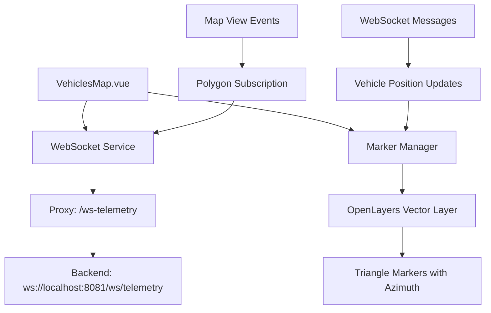

# Real-Time Vehicle Tracking Implementation Plan

## Overview
Implement WebSocket-based real-time vehicle tracking on the map in `src/components/VehiclesMap.vue` with triangle markers showing azimuth direction and smooth animations.

## Architecture

### System Components


### Data Flow
1. Map component initializes and connects to WebSocket
2. Subscribe to polygon based on current map view extent
3. Receive vehicle telemetry updates via WebSocket
4. Update markers with smooth animations (0.3s)
5. Update subscription when map view changes

## Implementation Details

### 1. WebSocket API Module (`src/api/telemetry.ts`)
- **WebSocket URL**: `ws://localhost:5173/ws-telemetry` (via proxy)
- **Connection Management**: Auto-reconnect with exponential backoff
- **Message Types**:
  - `subscribe_polygon`: Send polygon coordinates
  - `unsubscribe_polygon`: Clear previous subscription
  - Telemetry updates: Receive vehicle positions

### 2. TypeScript Interfaces
```typescript
interface Point {
  lon: number;
  lat: number;
}

interface SubscribePolygonMessage {
  type: 'subscribe_polygon';
  points: Point[];
}

interface TelemetryMessage {
  id: number | null;
  vehicleId: number;
  deviceId: number;
  packetTime: string;
  receptionTime: string;
  latitude: number;
  longitude: number;
  s2Cell: number;
  azimuth: number;
}

interface VehicleMarker {
  deviceId: number;
  vehicleId: number;
  feature: ol.Feature;
  lastPosition: [number, number]; // [lon, lat]
  lastAzimuth: number;
  animation?: {
    start: [number, number];
    end: [number, number];
    startTime: number;
    duration: number;
  };
}
```

### 3. Marker System
- **Triangle Markers**: Custom OpenLayers style with rotation based on azimuth
- **Smooth Animation**: Linear interpolation over 0.3s regardless of distance
- **Marker Management**: Map `deviceId` to features for updates
- **Cleanup**: Remove markers when outside visible area

### 4. Polygon Subscription Logic
- Convert map view extent to polygon coordinates
- Send `unsubscribe_polygon` before new subscription
- Throttle updates during map movement (debounce 500ms)
- Handle edge cases (small viewports, invalid coordinates)

### 5. Integration with VehiclesMap.vue
- Add WebSocket connection lifecycle to component
- Manage marker layer separate from base map
- Handle component mount/unmount with proper cleanup
- Add error handling and connection status display

## File Structure Changes

### New Files
```
src/api/telemetry.ts          # WebSocket service and types
src/utils/markerUtils.ts      # Marker creation and animation utilities
```

### Modified Files
```
src/components/VehiclesMap.vue  # Add real-time tracking functionality
```

## Implementation Steps

### Phase 1: Foundation
1. Create TypeScript interfaces for WebSocket messages
2. Implement WebSocket service with reconnection logic
3. Create basic marker utilities for triangle icons

### Phase 2: Integration
1. Add WebSocket connection to VehiclesMap component
2. Implement polygon subscription based on map view
3. Create marker layer and basic rendering

### Phase 3: Features
1. Add smooth animation for marker movement
2. Implement triangle rotation based on azimuth
3. Add marker management (add/update/remove)

### Phase 4: Polish
1. Add error handling and connection status
2. Implement proper cleanup on component unmount
3. Add performance optimizations (throttling, debouncing)

## Technical Considerations

### WebSocket Proxy Configuration
- Current proxy in `vite.config.ts`: `/ws-telemetry` → `localhost:8081/ws`
- Need to use relative URL: `ws://${window.location.host}/ws-telemetry`
- Handle both development and production environments

### Animation Implementation
- Use `requestAnimationFrame` for smooth 60fps animations
- Linear interpolation: `position = start + (end - start) * (timeElapsed / 300)`
- Cancel previous animations when new position arrives

### Performance Optimization
- Limit marker updates to visible area only
- Use feature pooling to avoid GC pressure
- Implement viewport-based culling

### Error Handling
- WebSocket connection errors with retry logic
- Invalid coordinate handling
- Memory leak prevention on component unmount

## Testing Strategy
1. **Unit Tests**: WebSocket service, marker utilities
2. **Integration Tests**: Map component with mock WebSocket
3. **Manual Testing**:
   - Connect to real backend
   - Verify marker rendering and animation
   - Test polygon subscription updates
   - Verify cleanup on component unmount

## Dependencies
- **OpenLayers**: Already installed (`ol@^10.9.0`)
- **No additional packages required**: Using native WebSocket API

## Success Criteria
- [ ] Vehicles display as triangle markers on map
- [ ] Markers rotate to show azimuth direction
- [ ] Smooth animation between position updates (0.3s)
- [ ] Real-time updates via WebSocket connection
- [ ] Polygon subscription updates with map movement
- [ ] Proper cleanup on component unmount
- [ ] Error handling and reconnection logic

## Risks and Mitigations
| Risk | Mitigation |
|------|------------|
| WebSocket connection drops | Implement exponential backoff reconnection |
| High update frequency causing lag | Throttle updates and use requestAnimationFrame |
| Memory leaks from marker accumulation | Implement proper cleanup and feature pooling |
| Proxy configuration issues | Fallback to direct connection with warning |

## Timeline
*Note: Focus on clear, actionable steps rather than time estimates*

1. **Phase 1**: Core infrastructure (WebSocket service, types, utilities)
2. **Phase 2**: Basic integration (markers on map, subscription)
3. **Phase 3**: Enhanced features (animation, rotation, management)
4. **Phase 4**: Polish and testing (error handling, optimization)

## Next Steps
1. Review and approve this plan
2. Switch to Code mode for implementation
3. Implement Phase 1 (WebSocket service and types)
4. Progressively implement remaining phases
5. Test and validate functionality